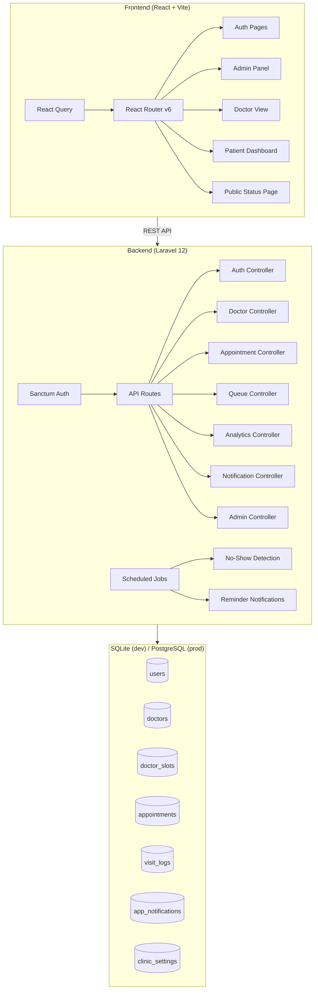

# MEDIQ — Implementation Plan

## Architecture Overview

## Build Phases

### Phase 1: Foundation ✅ COMPLETE
- [x] Create Laravel project
- [x] Create React + Vite project
- [x] Database migrations (9 tables: users, sessions, personal_access_tokens, password_reset_tokens, cache, jobs, doctors, doctor_slots, appointments, visit_logs, app_notifications, clinic_settings)
- [x] Seeders (admin, 4 doctors with slots, 3 patients, clinic settings)
- [x] Auth endpoints (login/register/logout/me)
- [x] Role-based middleware (CheckRole)
- [x] Login & Register page UI
- [x] Auth flow (token storage, role-based redirects)
- [x] AuthContext with React Query

### Phase 2: Core CRUD ✅ COMPLETE
- [x] Doctor management API (CRUD + slots)
- [x] Doctor slot management API
- [x] Admin panel shell with sidebar navigation
- [x] Admin Dashboard with live stats
- [x] Admin Manage Doctors page
- [x] Doctor Schedule (weekly grid view)
- [x] Patient Dashboard with upcoming/past appointments
- [x] Full design system (Healthcare White + Teal theme)

### Phase 3: Booking & Queue ✅ COMPLETE
- [x] Appointment booking API with validation
- [x] Multi-step booking form (Doctor → Date/Time → Confirm)
- [x] Admin booking for walk-in patients
- [x] Patient self-booking
- [x] Queue API (today's queue per doctor)
- [x] Admin Queue Management (select doctor, view queue)
- [x] Mark arrived / start / end consultation / no-show actions
- [x] Queue position recalculation
- [x] Emergency patient insertion

### Phase 4: Intelligence ✅ COMPLETE
- [x] Wait-time estimation algorithm
- [x] Public patient status page (no auth, UUID-based)
- [x] Visit log recording (start/end timestamps)
- [x] Average consultation duration tracking
- [x] Delay detection and alert system
- [x] Analytics dashboard (overview, doctor stats, peak hours)
- [x] Doctor History page with search & filters
- [x] Patient appointment cards with Live Status links

### Phase 5: Automation ✅ COMPLETE
- [x] No-show detection scheduled job (`mediq:detect-no-shows`) — runs every 5 min
- [x] Appointment reminder notifications (`mediq:send-reminders`) — runs every 10 min  
- [x] In-app notification system (booking confirmations, delay alerts, reminders, cancellations, no-shows)
- [x] Notification bell with unread count and dropdown
- [x] Mark-all-read functionality
- [x] Doctor view with live queue management
- [x] Admin Settings page (clinic config, user management)

### Phase 6: Polish & Deploy 🔄 READY
- [ ] Migrate to PostgreSQL (Supabase) for production
- [ ] Deploy backend (Render / Railway)
- [ ] Deploy frontend (Vercel / Netlify)
- [ ] Update environment variables for production
- [ ] Security audit (CORS, rate limiting)
- [ ] Mobile responsive testing
- [ ] End-to-end testing
- [ ] Final QA

## Key Technical Decisions
1. **Token-based auth** (not cookie-based SPA) — simpler CORS, no CSRF issues
2. **Polling** over WebSockets — `refetchInterval: 10-30s` with React Query for real-time feel
3. **SQLite for development** — zero config; PostgreSQL planned for production
4. **`whereDate()`** everywhere — SQLite stores dates with time component, so exact string matching fails
5. **`display_errors` suppressed** — `sebastian/version` tries `proc_open(git)` which fails on Windows, corrupting JSON responses

## Demo Credentials
| Role    | Email              | Password    |
|---------|--------------------|-------------|
| Admin   | admin@mediq.com    | password123 |
| Doctor  | priya@mediq.com    | password123 |
| Patient | amit@example.com   | password123 |
